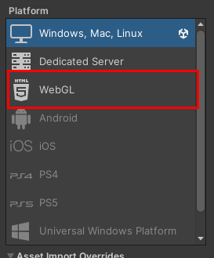

# Learning Unity Essentials

Took below course and summarized essentials. 

- [Unity Introduction(KOR)](https://youtube.com/playlist?list=PLC2Tit6NyVida7Jh6gSlw1BicuEUCFV6V)
- [Unity Beginner Tutorials(ENG)](https://youtube.com/playlist?list=PLPV2KyIb3jR5QFsefuO2RlAgWEz6EvVi6)

Started learning Unity to create websites like below(web + metaverse)

- [Cybertruck](https://bruno-simon.com/#cybertruck)
- [Kode Sports Club](https://www.kodeclubs.com/)

Install Unity at offical home page with license. License will be issued based on your account and license choice. Adjust Unity editor installation folder and general tab as well. Choose Unity version and add/install. 

## Understanding how project is structured
There are many details to create one game project.

- levels : map of the game => adjust file orders in build settings to match levels
- scene : .unity files
- prefabs : user-defined Unity object template. maintained to improve reusability
- Canvas : adding UI screens to game => start/end
- scripts : controls game object logics
- assets : sounds, fonts, materials .. 
- camera and light

- start screen ===(level 1)====>(...)====>(last level)====> end screen

### Unity Hub
You can add modules for more supports such as Web GL and Linux build in Unity hub. Install Webl GL to publish your game. 



## Learning by doing
Summarized what I learned in a blockquote style. 

> The MonoBehaviour is a pre-made class by Unity. 1. file name and class name should be the same to apply C# script to your Unity game object 2. should inherit MonoBehaviour

```c#
// importing name space
using System.Collections;
using System.Collections.Generic;
using UnityEngine; // getting all the name spaces in Unity engine.
public class firstScript : MonoBehaviour
{
    // Start is called before the first frame update
    void Start() { Debug.Log("Started"); }
    // Update is called once per frame
    void Update() { }
}
```

> Awake : executed on a current scene once when the object is active. used to **initialize game object**.

```c# 
    private void Awake() { Debug.Log("Awake executed"); }
```

> OnEnable : execute whenever a **component gets active**.

```c# 
    private void OnEnable() { Debug.Log("OnEnable executed"); }
```

> Start funciton gets called **before the first Update function**. used to initialize data. Awake => OnEnable => Start

```c#
private void Start() { Debug.Log("Start function exectued"); }
```

> Update funciton gets called per frame when component is active. If FPS is 60, it means the funciton executes 60 times per second.

```c#
private void Update() { Debug.Log("Update funciton executed"); }
```

> OnDestroy executes when game object gets destroyed, scene changes, and game finishes.

```c#
private void OnDestroy() { Debug.Log("OnDestroy func executed"); }
```

> OnApplicationQuit exeuctes when game finishes. 

```c#    
private void OnApplicationQuit() { Debug.Log("OnApplicationQuit func executed"); }
```

## Reference
- [Unity Introduction(KOR)](https://youtube.com/playlist?list=PLC2Tit6NyVida7Jh6gSlw1BicuEUCFV6V)
- [Unity Beginner Tutorials(ENG)](https://youtube.com/playlist?list=PLPV2KyIb3jR5QFsefuO2RlAgWEz6EvVi6)