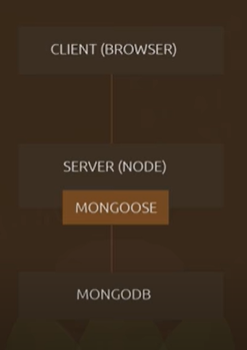
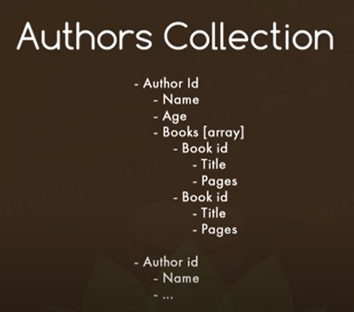
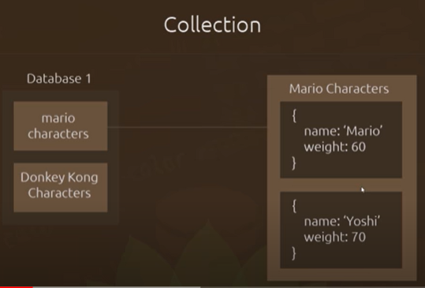
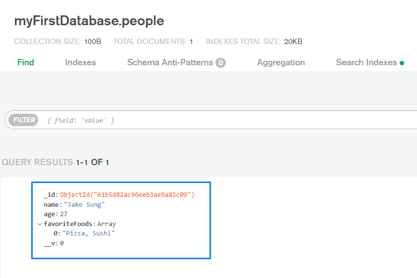
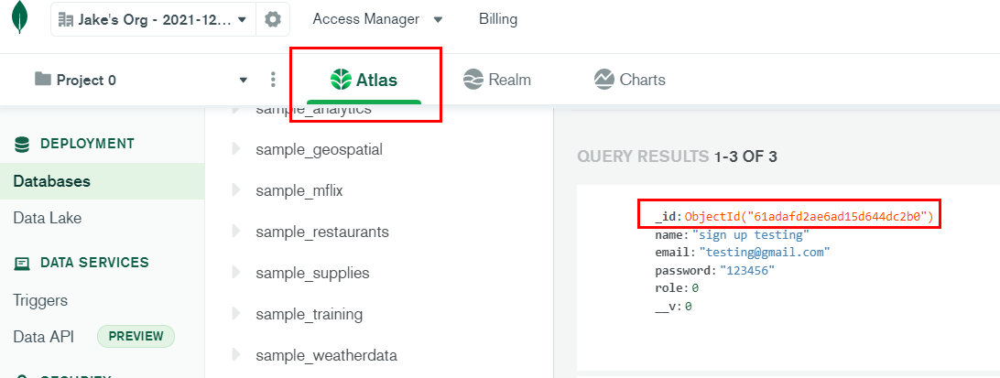
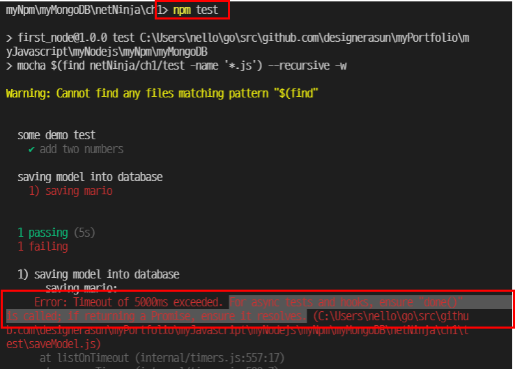

# Learning MongoDB essentials 
Took below courses and summarized essentials. 

- [NetNinja - MongoDB for beginners](https://www.youtube.com/playlist?list=PL4cUxeGkcC9jpvoYriLI0bY8DOgWZfi6u)

MongoDB is a NO-SQL database that stores JSON documents. Mongoose is a npm package used to control MongoDB with Javascript, creating schemas. 

- SQL : table, row, column
- NO-SQL : collection, document

```json
{
    "_id" : 12345, 
    "blogs" : [
        { "title" : "hello world" },
        { "title" : "goodbye world" },
    ]
}
```

MongoDB's format is JSON, which is Javascript Object Notation. 

<span>Web - Server - Database</span><br/>


- Web client : HTML, CSS, Javascript
- Web server : Node.js/Express
- Database : JSON, Mongoose

## Table of Contents
- [Installation]()
- [Connection]()
- [Schema, Collection, And Model]()
- [Testing With Mocha]()
- [Login and Hash]()
- [Comparison With Relational Database]()

## Comparison With Relational Database
### Relational DB : SQL
Create two different tables and tangle them with SQL. 


### MongoDB : No-SQL
Create two different objects and nest. 


```javascript
const mongoose = require('mongoose')
const Schema = mongoose.Schema

const BookSchema = new Schema({
    title: String, 
    pages: Number
})

const AuthorScheam = new Schema({
    name: String,
    age: Number, 
    book: [BookSchema] // nested
}) 

// mongoose.model(model name, model schema)
const Author = mongoose.model('Author', AuthorSchema)
module.exports = Author
```

## Installation
Deployment with MongoDB can be served with 
- Atlas : MongoDB as a service
- On-premises : Local MongoDB => install MongoDB Compass
- Mobile & Edge : Realm mobile database. Lightweight data storage for mobile and edge

## Connection
1. Create an account in MongoDB website
2. Choose a plan : 1) serverless 2) dedicated 3) shared(free, 1 per account)
3. Set database username and password, which will be used in Mongoose. 
4. Set other configurations for the MongoDB, like **IP Access List**. One of the common reasons of DB connection failure is not to include your IP address.
5. Get your MongoDB Atlas URI and set **environment variables**. 
6. Require Mongoose/Express in your Javascript file and connect database like below.

<details>
    <summary>Understanding Mongoose</summary>

Mongoose is an object document mapping library(**ODM library**). Connecting MongoDB and your backend can be done other than Mongoose if preferred. 
</details>

During connecting MongoDB using mongoose/express, database info such as username and password is required and can be seen in codes. Also, sensitive information such as API key should not be displayed in public neither. Thus, environment variable/file is needed to manage that. 

```js
// Environment variable in Node.js
// The process.env property returns an object containing the user environment.
process.env // global object. approachable in whole application. 

// case 1 : using process.env to import MONGO_URI
const mongoose = require('mongoose')
const MONGO_URI = process.env.MONGO_URI // In .env file, MONGO_URI="your_uri". No space allowed in .env file.

mongoose.connect(MONGO_URI, { })
        .then(()=>{ console.log("MongoDB connected") })
        .catch((err)=>{ console.log(err) })

// case 2 : using modules to import MONGO_URI
module.exports = { MONGO_URI : "your_uri" } // file name : key.js
require('./key')

mongoose.connect(MONGO_URI, {})
        .then(()=>{ console.log("MongoDB connected") })
        .catch((err)=>{ console.log(err) })
```


## Schema, Collection, And Model
In creating database, the first thing we need is to create a schema. Each schema maps to a MongoDB collection. 

- Schema => Collection => Model ===(instantiation)===> Document

In MongoDB, a lot of databases can exist. Choose the one that you need and connect it using mongoose. 
Database is structured as follows

- 

<details>
    <summary>What is schema?</summary>

- Model : a list of concepts describing data **(abstract)**
- Schema : a list of attributes and instructions **where database engine reads/follows(concrete, physical)**. Schema is to decide and tell the record what type of property they should have. 

```Javascript
const mongoose = require('mongoose') 

// Create a schema
const HumanSchema = moongose.Schema({
    name : {
        type : String, 
        required : true
    }
    age : Number
})

```
</details>

## CRUD in MongoDB
Inserting, searching, updating, and deleting are asynchronous actions in database. The 'done' callback function should be called once the asynchronous operations are done.

```javascript
// done callback convention in Node.js
const doSomething = function (done) { 
    if (err) return console.log(err)
    done(null, result)
}

```

Types of Mongoose CRUD methods are as follows(cb : short for callback). Methods are pretty much self-explanatory.

- mongoose.Schema
- mongoose.model
- document.save
- model.find(filter, cb) : find all matches
- model.findOne(filter, cb) : find one match
- model.findById(filter, cb) : find one match with the id
- model.findAndUpdate(filter, update, new) : set the third argument 'new'. Otherwise it will return unchanged object by default. 
- model.findByIdAndRemove(filter, cb)
- model.remove : delete all matches. returns JSON object, not updated(meaning some records deleted) docs. 
- chain search : making **query chains** to narrow results.

```javascript 
// query chain search in MongoDB
const queryChain = (done) => { 
    const myKeyword = "sushi"
    Sushi.find(myKeyword)
         .sort( { price : 1 } ) // show expensive sushi first
         .limit(5) // show 5 of them 
         .select( { location : 1} ) // show location 
         .exec(function(err, data) {
             if (err) return console.log(err)
             done(null, data)
         }) // execute queries. If exec method is not provided with the callback, it won't work. 
}

```

### Creating And Saving records
You can create model and save the document(model instance) in database, which is the purpose of creating it. 

```Javascript 
// Create a model from schema
let Person = mongoose.model('Person', personSchema);

const createAndSavePerson = (done) => {
  // Create a document(model instance)
  const person = new Person( {
    name : "Jake Sung", 
    age : 27, 
    favoriteFoods : ["Pizza, Sushi"]
   })

   // Save the document in database
   person.save(function(err, data) { 
    if (err) return console.log(err)
    done(null, data);
   })
};
```

<span>Document is stored in database</span><br/>


When saving a document, **MongoDB creates a field called "_id"**, which is a unqiue alphanumeric(letter + number) key. **Searching records by _id** is super common operation in MongoDB. 

### Finding records
- find(condition) : find **multiple records** matched with the conditions
- findOne(condition) : find the **first record** matched with the condition

#### Object ID
Once model instance(document) is saved in the database, how do we know which one is which if the name is all the same? **Finding a specific record is done with object id** since each record in database has a different object id.
 


### Deleting records
- model(instance).remove
- model(whole collections).remove 
- model.findOneAndRemove

- 1. Create and save a new record
- 2. Use findOneAndRemove to remove the record
- 3. Use findOne to check if the removed record exists. It should be null if deleted. 

### Updating records
- model(instance).update
- model(whole collections).update 
```javascript
myModel.update({}, {$inc : { weight : 1 } }) // update whole collections, increasing weight property by 1 
```

- model.findOneAndUpdate

- 1. Create a save a new record
- 2. Use findOneAndUpdate to update the record
- 3. Use findOne to check the updated record. Its value should be changed.

## Testing With Mocha
Mocha is a testing framework used to make test cases. Running tests consistently ensures newly added features are well integrated with previous ones. 

You can test such as : 
- Creating records
- Reading records
- Updating records
- Deleting records

Install Mocha like below

```shell
$npm install mocha --save

# Installing mocha is not required for production setting.
$npm install mocha --save-dev
```

<details> 
<summary>What is assert in Node js?</summary>

**Assert is a built-in module in Node.js**. It evaluates a value parameter and if it is not true, throw error. 

```javascript
assert(value, message) // message is optional
```
</details> 


### Mocha configuration in package.json
Configurate Mocha like below in package.json to use Mocha with command npm test.

```json
  "scripts": {
    "test": "node_modules/.bin/mocha $(find your/foler/directory -name '*.js') --recursive -w",
    "start": "nodemon"
  },
```

### Handling Asynchronous Request With Mocha
Saving model into database is an asynchronous request. Deliver 'done' function parameter provided by Node.js and call it after the asynchronous request is done. 

```javascript
myModel.save()
       .then(function(done) {
           // do what is needed
           done(); // finish the asynchronous request
       }); 

```

When the done parameter is not properly delivered
- 

When delivered
- 

## Reference
- [NetNinja - MongoDB for beginners](https://www.youtube.com/playlist?list=PL4cUxeGkcC9jpvoYriLI0bY8DOgWZfi6u)