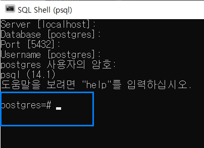
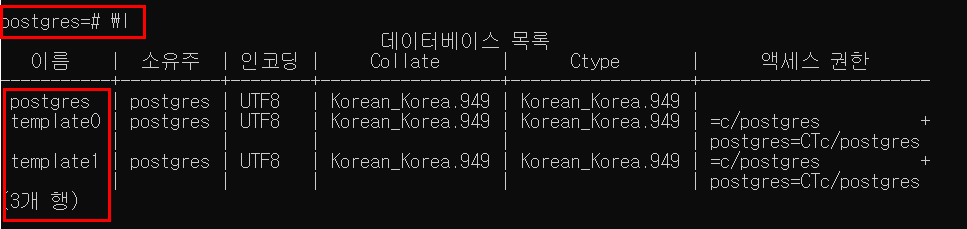
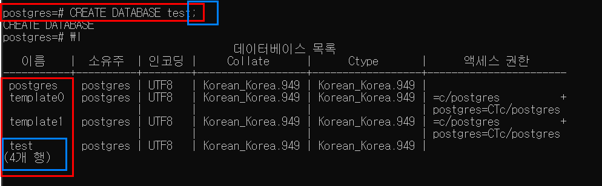
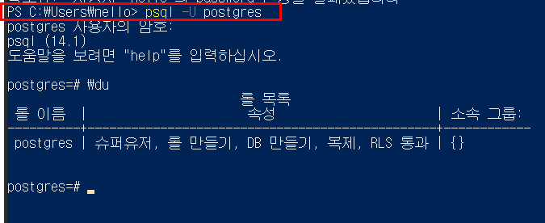
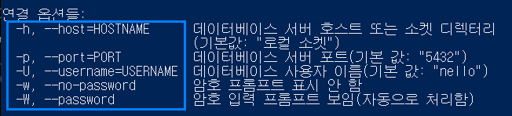

# Learning PostgreSQL essentials
Took below courses and summarized essentials. 

- [PostgreSQL - AmigosCode](https://www.youtube.com/watch?v=tzbA7VniRpw&list=PLwvrYc43l1MxAEOI_KwGe8l42uJxMoKeS&index=3)

## What is PostgreSQL?
> PostgreSQL is a powerful, open source object-relational database system with over 30 years of active development that has earned it a strong reputation for reliability, feature robustness, and performance.

<p>
Install the latest PostgreSQL and follow the install manager instruction. pgAdmin 4(GUI for PostgreSQL) and SQL Shell comes to gether. 
</p>

Check Postgre version with command below.

```shell
$postgres -V
```

## Connecting to DB server
Once the database is installed and up, basically your computer becomes a database server that anyone can connect. You can connect the database by tools like 

- GUI client : e.g pgAdmin
- Terminal/CMD : SQL Shell

Go find SQL Shell and enter your info. Once hash symbol is checked like below, your local database is connected. 



Or you can simply access it with pgAdmin4. 

### Adding psql to path
Add your PostgreSQL bin directory to environment variable so that you can call the database in anywhere. 

## Creating databse with PSQL commands
Access to psql shell and check created databases with below command. 

```shell
# list out databases created
\l
```



Create a test database and check out result. 

```sql
CREATE DATABASE test;
```



- list up all the users(roles) with command \du. 



- Create/drop a new user with a few authorizations by below psql command.

```sql
CREATE ROLE username WITH CREATEDB CREATEROLE LOGIN
```

### Connection options
- With command psql --help, you can check connection options. 



## Reference
- [Postgre official](https://www.postgresql.org/)