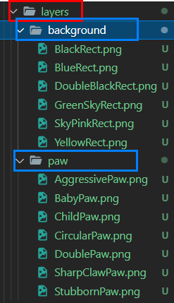

# Learning How to Code Generative Images
Took below course and summarized essentials.

- [HashLips NFT - Create 10000 generative NFTs](https://www.youtube.com/watch?v=vFY_E3IP6OU&list=PLvfQp12V0hS1PWDxlrfASk0Mq6AbC5n5f&index=1)

Note that this tutorial is based on original [release version 1.0.1.](https://github.com/HashLips/hashlips_art_engine/releases/tag/v1.0.0_update)

## Original release version 1.0.0
> In this release, users can add their images (layers) in the layers folder and generate multiple different instances based on the combination of the image layers. Metadata (json) is also created for each image so that it will fit with the NFT standards.

## Usage
The usage of HashLips is very simple. Only two things to bear in mind : layer order and edition size. The layer order **should be the same** with your layers folder structure. 

```js 
// should be matched with layer folder order. 
const layersOrder = [
  { name : "background"}, 
  { name : "paw"}, 
];
```



And then decide the number of images you are going to create. 

```js
// decide how many images to create. 
// run node command to execute and then check build folder for result. 
const editionSize = 10;
```

## Layer configuration
In HashLips version 1.0.2, layer configuration is added. Stacked layered by object now will be differentiated and will create the number of editions it is assigned to. 

```js
const layerConfigurations = [
  {
    growEditionSizeTo: 5,
    layersOrder: [
      { name: "background" , opacity : 0.5 },
      { name: "edge", blend : MODE.color },
      { name: "paw" },
    ],
  },
  {
    // Total number of eiditions are now 10.
    growEditionSizeTo: 10,
    layersOrder: [
      { name: "background" , opacity : 0.5 },
      { name: "edge" },
      { name: "fish" },
    ],
  },
];

```

## Adding rarity
Adjust rarity by changing layer asset image file name. For example, from "BlackRect.png" to ""BlackRect(rarity unit)80.png".

The rarity unit by default is set to asterisk. If your OS is Window, which does not support the symbol as file name, should be replaced to something else. 

```js
const getRarityWeight = (_str) => {
  let nameWithoutExtension = _str.slice(0, -4);
  console.log(_str.slice(0,-4))
  // changed symbol here
  var nameWithoutWeight = Number(nameWithoutExtension.split(/[@ ]+/).pop());
  if (isNaN(nameWithoutWeight)) {
    nameWithoutWeight = 0;
  }
  return nameWithoutWeight;
};

const cleanName = (_str) => {
  let nameWithoutExtension = _str.slice(0, -4);
  // changed symbol here
  var nameWithoutWeight = nameWithoutExtension.split(/[@ ]+/).shift();
  return nameWithoutWeight;
};
```

## Updating Base URI for future IPFS uploading
In version 1.0.4, there had been added utility function that updates JSON file's meta data. For example, 

```js 
// update this url then changes will be reflected to all json files. 
const baseUri = "ipfs://QmNfPMWLPTEbFpBtPFy4wkYEHRVWcz8dzjziTcPbebzF53";
```

Change above baseUri with below updateBaseUri.js. 

```js 
"use strict";

const fs = require("fs");
const path = require("path");
const isLocal = typeof process.pkg === "undefined";
const basePath = isLocal ? process.cwd() : path.dirname(process.execPath);

const { baseUri } = require("../src/config.js");

// read json data
let rawdata = fs.readFileSync(`${basePath}/build/json/_metadata.json`);
let data = JSON.parse(rawdata);

data.forEach((item) => {
  item.image = `${baseUri}/${item.edition}.png`;
  fs.writeFileSync(
    `${basePath}/build/json/${item.edition}.json`,
    JSON.stringify(item, null, 2)
  );
});

fs.writeFileSync(
  `${basePath}/build/json/_metadata.json`,
  JSON.stringify(data, null, 2)
);

console.log(`Updated baseUri for images to ===> ${baseUri}`);

```

## Metadata
The metadata created for the image is as follows(as of version 1.0.4)

```json
  {
    // dna is hashed
    "dna": "577a7a41b2d5feb0e5efca3cca8470c31b2e24bf",
    "name": "#1",
    "description": "This is the description of your NFT project, remember to replace this",
    // image will be hosted in IPFS
    "image": "ipfs://QmNfPMWLPTEbFpBtPFy4wkYEHRVWcz8dzjziTcPbebzF53/1.png",
    "edition": 1,
    "date": 1643475333380,
    "attributes": [
      {
        // layer folder and its value here
        "trait_type": "background",
        "value": "BlackRect"
      },
      {
        "trait_type": "edge",
        "value": "Middle"
      },
      {
        "trait_type": "paw",
        "value": "CircularPaw"
      }
    ],
    "compiler": "HashLips Art Engine"
  },
```

## Extra configuration
In version 1.0.6, there have been a few more configurations added. 

```js
// shuffle end result file order
const shuffleLayerConfigurations = true;

// log details
const debugLogs = false;

// add extra metadata to created json files
const extraMetadata = {
  contributor : "Jake"
};
```

## Gif export support
In version 1.0.9, blockchain metadata selection(ethereum and solana) and gif export has been added. 

```js
// Change blockchain : ethereuem, solana
const network = NETWORK.eth;

// gif config
const gif = {
  export: true,
  repeat: 0,
  quality: 100,
  delay: 500,
};
```

## Latest engine update
Version 1.1.2 is the latest version of HashLips art engine. Updates are as follows : 

1. Metadata rarity update
2. Node js version fix
3. Gif as a preview
4. Metadata from colors
5. Community improvements


## Reference
- [HashLips release](https://github.com/HashLips/hashlips_art_engine/releases?page=2)