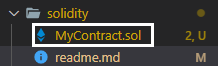
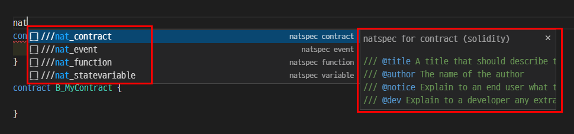
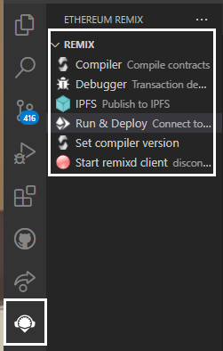
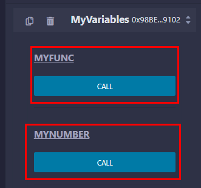
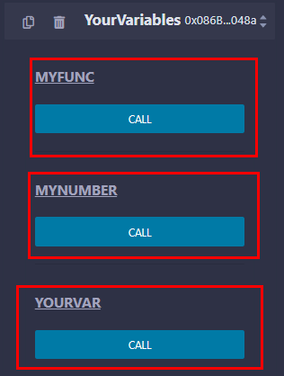

# Learning Solidity Essentials
Took below course and summarized essentials. 

- [HashLips : Learn Solidity basics](https://www.youtube.com/watch?v=sngKPYfUgkc&list=PLvfQp12V0hS2PQd9-X-E2AjmXj1o05WOo&index=1&t=3178s)

## Solidity
> Solidity is an object-oriented, high-level language for implementing smart contracts. Smart contracts are programs which govern the behaviour of accounts within the Ethereum state. Solidity is a curly-bracket language. It is influenced by C++, Python and JavaScript, and is designed to target the Ethereum Virtual Machine (EVM).

```sol
// SPDX-License-Identifier: GPL-3.0
pragma solidity ^0.8.11; // this line is very important, clarifying compiler version.

// Emmet for natspac in VS Code : nat_contract
/// @title First solidity smart contract exercise
/// @author Jake Sung
/// @notice Explain to an end user what this does
/// @dev Explain to a developer any extra details
contract MyContract {
    string public name = "Jake Sung";

    function UpdateName(string memory _newName) public {
        name = _newName;
    }
}
```

> **With Solidity you can create contracts** for uses such as voting, crowdfunding, blind auctions, and multi-signature wallets.

> When deploying contracts, **you should use the latest released version of Solidity**. Apart from exceptional cases, only the latest version receives security fixes. Furthermore, breaking changes as well as new features are introduced regularly. We currently use a 0.y.z version number to indicate this fast pace of change.

### Ethereum virtual machine
> The Ethereum Virtual Machine or EVM is **the runtime environment for smart contracts in Ethereum**. It is not only sandboxed but actually completely isolated, which means that **code running inside the EVM has no access to network, filesystem or other processes**. Smart contracts even have limited access to other smart contracts.

### Convention
Naming in Solidity code is as follows : 

- file name is in Camel Case, starting with upper case.


### Pragma
> A **pragma** is a compiler directive that allows you to provide additional information to the compiler. This information can change **compilation details** that are not otherwise under your control. For example, the pack pragma affects the layout of data within a structure. Compiler pragmas are also called directives.

Use below emmets to auto-generate Pragma and license identifier.

```
pragm
SPDX
```

### NatSpec Format
> Solidity contracts can use **a special form of comments** to provide rich documentation for functions, return variables and more. This special form is named the **Ethereum Natural Language Specification Format** (NatSpec). ... It is recommended that Solidity contracts are fully annotated using NatSpec for all public interfaces (everything in the ABI).



### Address
> The address type comes in two flavours, which are largely identical: 1) address: Holds a 20 byte value (size of an Ethereum address). 2) address payable: Same as address, but with the additional members transfer and send.

> The idea behind this distinction is that **address payable** is an address you **can send Ether to**, while a plain address cannot be sent Ether. Implicit conversions from address payable to address are allowed, whereas conversions from address to address payable must be explicit via payable(<address>).

### Reference types : struct, array, mapping
>  If you use **a reference type, you always have to explicitly provide the data area** where the type is stored: 

- memory (whose lifetime is limited to an external function call), 
- storage (the location where the state variables are stored, where the lifetime is limited to the lifetime of a contract) 
- calldata (special data location that contains the function arguments).

> Values of reference type can be modified through multiple different names. Contrast this with value types where you get an independent copy whenever a variable of value type is used. Because of that, reference types have to be handled more carefully than value types.

> **Every reference type** has an additional annotation, the **“data location”**, about where it is stored. There are three data locations: **memory, storage and calldata**. 

#### Memory, storage, calldata
> Storage and Memory keywords in Solidity are analogous to Computer’s hard drive and Computer’s RAM. Much like RAM, Memory in Solidity is a temporary place to store data whereas Storage holds data between function calls. The Solidity Smart Contract can use any amount of memory during the execution but once the execution stops, the Memory is completely wiped off for the next execution. Whereas Storage on the other hand is persistent, each execution of the Smart contract has access to the data previously stored on the storage area.

> Every transaction on Ethereum Virtual Machine costs us some amount of Gas. The lower the Gas consumption the better is your Solidity code. The Gas consumption of Memory is not very significant as compared to the gas consumption of Storage. Therefore, it is always better to use Memory for intermediate calculations and store the final result in Storage.

### Function
#### Modifier
> Modifiers can be used to change the behaviour of functions in a declarative way. For example, you can use a modifier to automatically check a condition prior to executing the function.

> Modifiers are inheritable properties of contracts and may be overridden by derived contracts, but only if they are marked virtual

```solidity
modifier onlyOwner {
        require(
            msg.sender == owner,
            "Only owner can call this function."
        );
        _;
    }
```

#### Pure function
> Functions can be declared pure in which case they promise not to read from or modify the state. In particular, it should be possible to evaluate a pure function at compile-time given only its inputs and msg.data, but without any knowledge of the current blockchain state. This means that reading from immutable variables can be a non-pure operation.

### Contract
> Contracts in Solidity are similar to classes in object-oriented languages. They contain persistent data in state variables, and functions that can modify these variables. Calling a function on a different contract (instance) will perform an EVM function call and thus switch the context such that state variables in the calling contract are inaccessible. A contract and its functions need to be called for anything to happen. There is no “cron” concept in Ethereum to call a function at a particular event automatically.

> One way to create contracts programmatically on Ethereum is via the JavaScript API web3.js. It has a function called web3.eth.Contract to facilitate contract creation.

#### Constructor
> When a contract is created, its constructor (a function declared with the constructor keyword) is executed once.

> A constructor is optional. Only one constructor is allowed, which means overloading is not supported.

> After the constructor has executed, the final code of the contract is stored on the blockchain. This code includes all public and external functions and all functions that are reachable from there through function calls. The deployed code does not include the constructor code or internal functions only called from the constructor.

### Error handling
> Solidity provides various functions for error handling. Generally when an error occurs, the state is reverted back to its original state. Other checks are to prevent unauthorized code access. Following are some of the important methods used in error handling −

1. assert(bool condition) − In case condition is not met, this method call causes an invalid opcode and any changes done to state got reverted. This method is to be used for internal errors.

1. require(bool condition, string memory message) − In case condition is not met, this method call reverts to original state. - This method is to be used for errors in inputs or external components. It provides an option to provide a custom message.

1. revert(string memory reason) − This method aborts the execution and revert any changes done to the state. It provides an option to provide a custom message.


## Remix
Remix is a online editor to compile Solidity. You can either go below website, 

- [Remix IDE](https://remix.ethereum.org/)

or install extension in VS code. 



> This project brings Remix plugins to Visual Studio Code. Remix plugins can perform a variety of tasks such as verifying contracts, linting, generating documentation, running tutorials, compiling, debugging and much more. The Remix Plugin API allows plugins that run in Remix to run in Visual Studio Code too.

Note that Remix tells us which execution would cost gas by color. If orange, cost gas. If not, not.

## Basics
### State variable
Variables in solidity contract lie in blockchain and are called state variable.

```solidity
pragma solidity ^0.8.0;

contract MyVariables { 
    uint256 number = 20; // state variable
    bool paused = true; // state variable
}
```

### Inheritance
Contracts in one solidity file can interact each other by inheritance. For example, 

```
// SPDX-License-Identifier: MIT
pragma solidity ^0.8.0;

contract MyVariables { 
    uint256 public myNumber = 20; // state variable, living forever with smart contract

    function myFunc() public view {
        // empty function
    }
}

// Inheritance in Solidity
contract YourVariables is MyVariables { 
    uint256 public yourVar = 200; 
}
```

Compile the above code and deploy it to Ganache blockchain. Then you can check below result. 



Child contract can access to the parent contract's function and variables. 



### Units and globally available varaibles
> Ether Units : A literal number can take a suffix of wei, gwei or ether to specify a subdenomination of Ether, where Ether numbers without a postfix are assumed to be Wei.

```js
assert(1 wei == 1);
assert(1 gwei == 1e9);
assert(1 ether == 1e18);
```

### Event
> Events are convenience interfaces with the EVM logging facilities.
> Solidity events give an abstraction on top of the EVM’s logging functionality. Applications can subscribe and listen to these events through the RPC interface of an Ethereum client.

> When you call them, they cause the arguments to be stored in the transaction’s log - a special data structure in the blockchain. These logs are associated with the address of the contract, are incorporated into the blockchain, and stay there as long as a block is accessible (forever as of now, but this might change with Serenity). The Log and its event data is not accessible from within contracts (not even from the contract that created them).

```solidity
// SPDX-License-Identifier: GPL-3.0
pragma solidity >=0.4.21 <0.9.0;

contract SimpleAuction {
    event HighestBidIncreased(address bidder, uint amount); // Event

    function bid() public payable {
        // ...
        emit HighestBidIncreased(msg.sender, msg.value); // Triggering event
    }
}
```


## Blockchain basics
> Blockchains as a concept are not too hard to understand for programmers. The reason is that most of the complications (mining, hashing, elliptic-curve cryptography, peer-to-peer networks, etc.) are just there to provide a certain set of features and promises for the platform. Once you accept these features as given, you do not have to worry about the underlying technology - or do you have to know how Amazon’s AWS works internally in order to use it?

### Transaction
> A blockchain is a globally shared, transactional database. This means that everyone can read entries in the database just by participating in the network. If you want to change something in the database, you have to create a so-called transaction which has to be accepted by all others. The word transaction implies that the change you want to make (assume you want to change two values at the same time) is either not done at all or completely applied. Furthermore, while your transaction is being applied to the database, no other transaction can alter it.

### Block 
> One major obstacle to overcome is what (in Bitcoin terms) is called a “double-spend attack”: What happens if two transactions exist in the network that both want to empty an account? Only one of the transactions can be valid, typically the one that is accepted first. The problem is that “first” is not an objective term in a peer-to-peer network.

> The abstract answer to this is that you do not have to care. A globally accepted order of the transactions will be selected for you, solving the conflict. The transactions will be bundled into what is called a “block” and then they will be executed and distributed among all participating nodes. If two transactions contradict each other, the one that ends up being second will be rejected and not become part of the block.

## Reference
- [Solidity official](https://docs.soliditylang.org/en/v0.8.11/)
- [VS Code marketplace : Ethereum Remix](https://marketplace.visualstudio.com/items?itemName=RemixProject.ethereum-remix)
- [Oracle : Pragmas](https://docs.oracle.com/cd/E19957-01/806-3571/Pragmas.html#:~:text=A%20pragma%20is%20a%20compiler,pragmas%20are%20also%20called%20directives.)
- [Storage vs Memory - Geeks for geeks](https://www.geeksforgeeks.org/storage-vs-memory-in-solidity/#:~:text=Much%20like%20RAM%2C%20Memory%20in,off%20for%20the%20next%20execution.&text=Function%20arguments%20are%20in%20memory.)
- [Solidity error handling - tutorialspoint](https://www.tutorialspoint.com/solidity/solidity_error_handling.htm)
- [Solidity Contract - Solidity official](https://docs.soliditylang.org/en/v0.8.11/contracts.html)