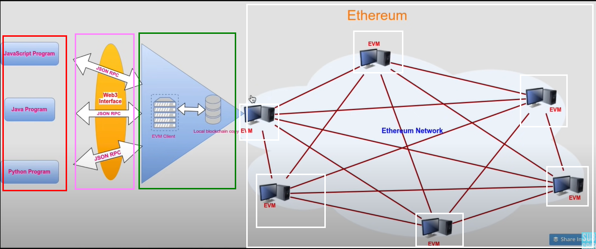
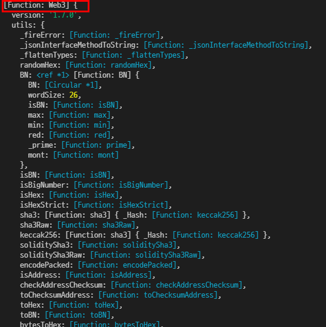
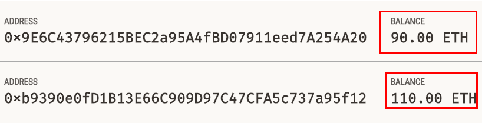

# Learning web 3 essentials
Took below courses and summarized essentials.

-[Dappuniversity - Web3.js · Ethereum Blockchain Developer Crash Course](https://www.youtube.com/playlist?list=PLS5SEs8ZftgXlCGXNfzKdq7nGBcIaVOdN)
-[Eat the block - web3 tutorial](https://youtube.com/playlist?list=PLbbtODcOYIoFs0PDlTdxpEsZiyDR2q9aA)

## Web3.js
Web3.js is a Javascript library for Ethereum. 

> This is the Ethereum **JavaScript API** which connects to the Generic **JSON-RPC** spec. You need to run a local or remote Ethereum node to use this library.
> Web3.js is a collection of libraries that allow you to interact with a local or remote ethereum node using HTTP, IPC or WebSocket.
> To **talk to an ethereum node from inside a JavaScript application** use the web3.js library, which gives a convenient interface for the RPC methods.

Overall structure for web3.js to communicate with Ethereum blockchain is as follows : 

 

<details>
<summary>What is JSON-RPC?</summary>

> JSON-RPC is a **remote procedure call protocol** encoded in JSON.
> JSON-RPC works by sending a request to a server implementing this protocol.

```json
// JSON-RPC Version 2.0
// request 
{"jsonrpc": "2.0", "method": "subtract", "params": {"minuend": 42, "subtrahend": 23}, "id": 3}

// response
{"jsonrpc": "2.0", "result": 19, "id": 3}
```
</details>

Install web3.js with below command. 

```shell
$npm i web3
```

 

Unit map in the web3 instance shows you how Ethereum can be converted to smaller units(mainly used in smart contract). 

```js
 unitMap: {
   noether: '0',
      wei: '1', // the smallest unit
      kwei: '1000',
      Kwei: '1000',
      babbage: '1000',
      femtoether: '1000',
      mwei: '1000000',
      Mwei: '1000000',
      lovelace: '1000000',
      picoether: '1000000',
      gwei: '1000000000',
      Gwei: '1000000000',
      shannon: '1000000000',
      nanoether: '1000000000',
      nano: '1000000000',
      szabo: '1000000000000',
      microether: '1000000000000',
      micro: '1000000000000',
      finney: '1000000000000000',
      milliether: '1000000000000000',
      milli: '1000000000000000',
      ether: '1000000000000000000',
      kether: '1000000000000000000000',
      grand: '1000000000000000000000',
      mether: '1000000000000000000000000',
      gether: '1000000000000000000000000000',
      tether: '1000000000000000000000000000000'
    },
```

### Infura and Ganache
Infura is a **blockchain toolkit platform** that connect you to blockchain(in this tutorial case, Ethereum) node over **JSON-RPC**. Sign up and create a project to network API key to access blockchain.

```js
import web3 from 'web3'
console.dir(web3)

const infuraAPI = 'API_KEY_HERE'
const myWeb3 = new web3(infuraAPI)

console.log(myWeb3)
```

You can use a local Ethereum blockchain using Ganache. 

> **Ganache is a personal blockchain** for rapid Ethereum and Corda distributed application development. You can use Ganache across the entire development cycle; enabling you to develop, deploy, and test your dApps in a safe and deterministic environment.
> The command-line tool, ganache-cli (formerly known as the **TestRPC**), is available for Ethereum development.

### Understanding ABI
Applicaiton Binary Interface is explained like below.

> The Contract Application Binary Interface (ABI) is the **standard way to interact with contracts in the Ethereum ecosystem**, both from outside the blockchain and for contract-to-contract interaction. **Data is encoded according to its type, as described in this specification**. The encoding is not self describing and thus requires a schema in order to decode.

Code example of ABI is as follows. It's from Etherscan MekaApes Game contract. 

```json
[{"inputs":[{"internalType":"address","name":"_logic","type":"address"},{"internalType":"address","name":"admin_","type":"address"},{"internalType":"bytes","name":"_data","type":"bytes"}],"stateMutability":"nonpayable","type":"constructor"},{"anonymous":false,"inputs":[{"indexed":false,"internalType":"address","name":"previousAdmin","type":"address"},{"indexed":false,"internalType":"address","name":"newAdmin","type":"address"}],"name":"AdminChanged","type":"event"},{"anonymous":false,"inputs":[{"indexed":true,"internalType":"address","name":"beacon","type":"address"}],"name":"BeaconUpgraded","type":"event"},{"anonymous":false,"inputs":[{"indexed":true,"internalType":"address","name":"implementation","type":"address"}],"name":"Upgraded","type":"event"},{"stateMutability":"payable","type":"fallback"},{"inputs":[],"name":"admin","outputs":[{"internalType":"address","name":"admin_","type":"address"}],"stateMutability":"nonpayable","type":"function"},{"inputs":[{"internalType":"address","name":"newAdmin","type":"address"}],"name":"changeAdmin","outputs":[],"stateMutability":"nonpayable","type":"function"},{"inputs":[],"name":"implementation","outputs":[{"internalType":"address","name":"implementation_","type":"address"}],"stateMutability":"nonpayable","type":"function"},{"inputs":[{"internalType":"address","name":"newImplementation","type":"address"}],"name":"upgradeTo","outputs":[],"stateMutability":"nonpayable","type":"function"},{"inputs":[{"internalType":"address","name":"newImplementation","type":"address"},{"internalType":"bytes","name":"data","type":"bytes"}],"name":"upgradeToAndCall","outputs":[],"stateMutability":"payable","type":"function"},{"stateMutability":"payable","type":"receive"}]
```

## Ethereum transaction
Anything that uses data in Ethereum triggers a transaction, which costs a gas fee. Once transaction gets triggered, it will broadcast to entire ethereum blockchain.

- all transactions in **development kit**(e.g Ganache), accounts are **unlocked**(no sign, no private key required)
- In real blockchain, transaction should be **_signed_** before broadcasting. 

```js
// account 1 : send 5 ethers to account 2
web3.eth.sendTransaction( { 
    from : account1, 
    to : account2, 
    value : web3.utils.toWei('5', 'ether')
})
```

 


## Reference
- [Web3.js - Readme](https://github.com/ChainSafe/web3.js/blob/1.x/README.md)
- [web3.js - Ethereum JavaScript API](https://web3js.readthedocs.io/en/v1.7.0/)
- [Infura - Ethereum JavaScript API](https://web3js.readthedocs.io/en/v1.7.0/)